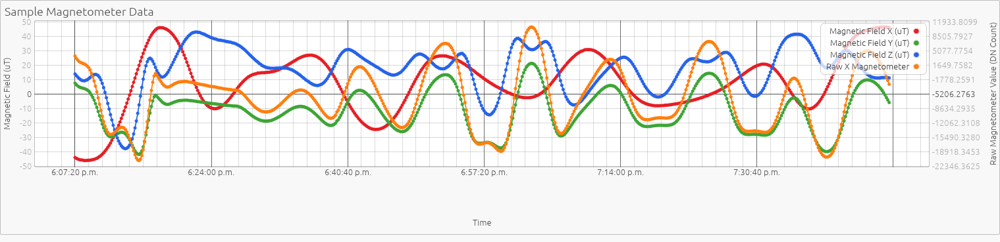

# daplot

GUI program for plotting CSVs/Parquets, made with Rust

## Features

- A native Rust desktop GUI, built with egui
- Plot a single CSV or Parquet table
- Chart and axis titles
- Primary + secondary Y axes
- Line/scatter/bar series with a legend
- Multiple subplots from the same data
- Date/time-range filter
- Export/copy as a PNG

## Example



## Requirements

- Rust 1.95+ (edition 2024).
- Linux only: GUI dev libraries for the windowing backend, e.g. on
  Debian/Ubuntu:
  ```bash
  sudo apt install libgtk-3-dev libxcb-render0-dev libxcb-shape0-dev \
      libxcb-xfixes0-dev libxkbcommon-dev libssl-dev
  ```

## Build and Run

### From Crates.io

```bash
cargo install daplot
daplot
```

### From Source

```bash
git clone https://github.com/DeflateAwning/daplot
cd daplot
cargo run --release
```

## Known Limitations

- Bar charts from multiple series on the same subplot are drawn overlapping
  (semi-transparent) rather than grouped side-by-side.
- The whole loaded table is kept in memory (no lazy/streaming reads), so
  very large files (many millions of rows) may be slow.
- Text-as-X-axis categories are ordered by first appearance in the file, not
  alphabetically or by frequency.

## Project History, Motivation, Creation

Yes, I know Microsoft Excel exists.

But, I don't like that Microsoft Excel requires Windows. LibreOffice Calc lacks
performance when dealing with thousands of rows, and is tough to get a graph looking
"just right" (axis labels, etc.).

While reviewing time-series sensor data daily as part of some recent work, I
decided it'd be worth it to build something like this for quick previews, assessments,
and for sharing the generated graphs.

This vibecoded tool hits the balance I was looking for. Hopefully it's useful for
you as well.
